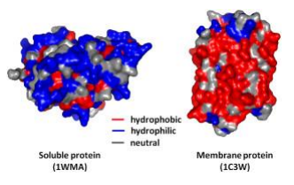
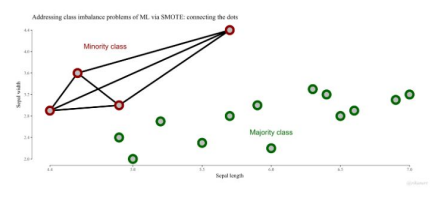
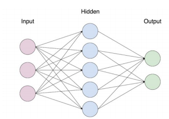
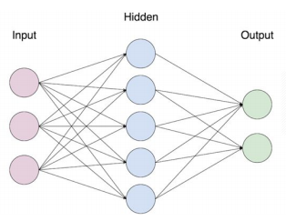
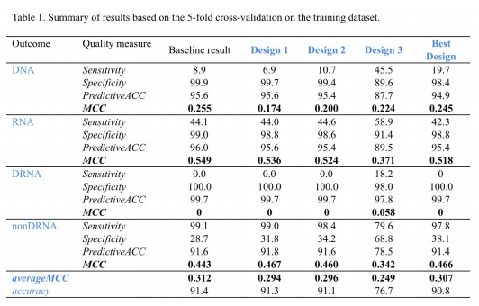

# Protein Classifier
This project's aim is to create an effective classifier that can classify an unkown sample of proteins to one of the following four categories based on their protein sequence.
1.  DNA - protein binds to DNA
2. RNA - binds to RNA
3. DRNA - binds to both DNA and RNA
4. NDRNA - does not bind with either DNA or RNA

## Project designs
- Design 1 - Amino acid composition of the given sequences 
- Design 2 - Based on Design 1, but with optimized parameters
- Design 3 - Added features through pseudo amino acid composition of the sequences

## Research
- Hydrophobicity
- Oversampling
- BLAST sequence matching

## Hydrophobicity
Very similar to the first iteration, the algorithm would determine the ratio of amino acids within the sequence. This time, however, three features were chosen: polar, neutral and hydrophobic. The hydrophobic dataset was joined with others to determine the optimum dataset.

## Oversampling
One of the ways that we tried to improve our model is through the use of oversampling, more specifically we used SMOTE (Synthetic Minority Oversampling Technique). This image illustrates the way SMOTE works. Taken from the link above, it shows the way SMOTE draws lines between points of a certain class and creates new data objects along these lines.

## BLAST
Another tool that we researched to improve our model is based on BLAST (Basic Local Alignment Search Tool) used by the NIH. BLAST finds regions of local similarity between sequences. Our sequence matcher uses two modules: unique-sequence module and sequence-similarity module.

### Design 1
The first design was fairly simple. The feature selection was just the percent composition of amino acids in the sequence. Obviously it wasn’t the most accurate model, but we had to start somewhere.

### Design 2
The second design is actually the first design but with the parameters optimized! By testing all 121 combinations of the Neural Net parameters, the averageMCC went up by 0.002 to .296. Even though it might not sound like a lot, every bit counts!

### Design 3
Our best and final design that we went with ended up being the Pseudo Amino Acid model. This model is actually an algorithm to calculate pseudo amino acid composition. The reason this was our best design is that the averageMCC was the highest at .307. Instead of relying on an online resource, we created a python script to transform the original dataset into our new dataset with pseudo feature selection. The new pseudo dataset had 51 features, that were in a Neural Network with optimized parameters.

### Result
While our original model used percent composition of the amino acids (known simply as amino acid composition), our final model used pseudo amino acid composition. Pseudo amino acid composition combines this with more features that also take into account the order of the sequence as well.

## Full report
Full report for this project can be found [here](report.pdf).